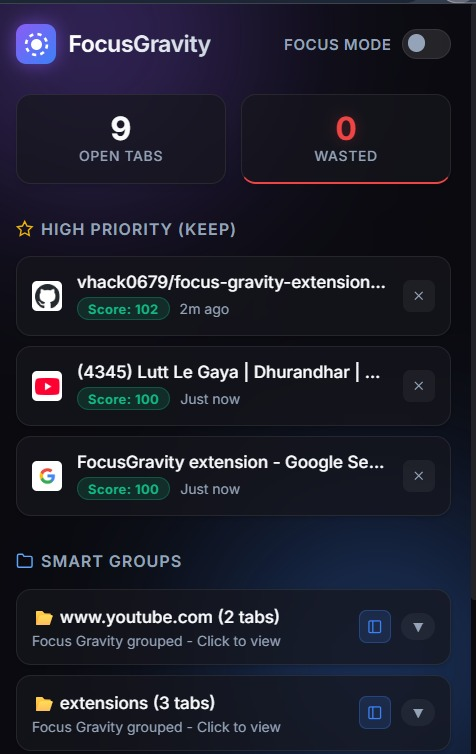
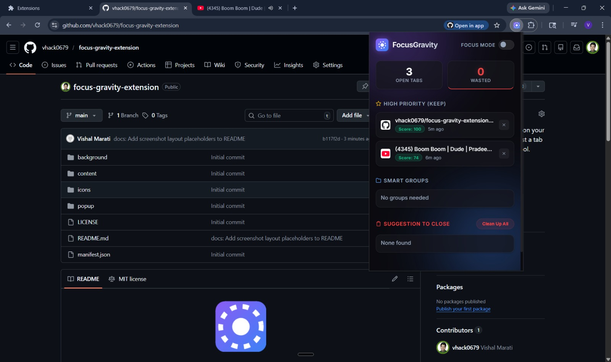
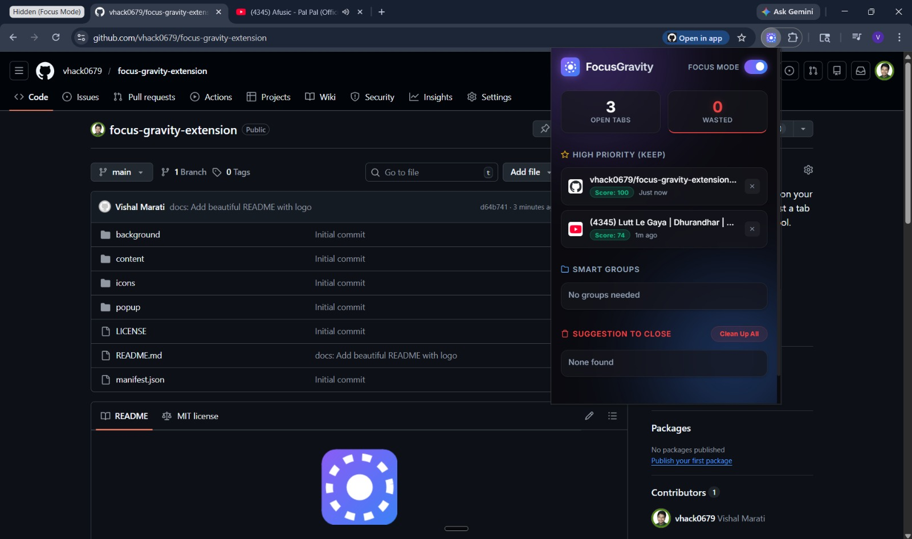

<div align="center">
  

  # FocusGravity
  **Understand, prioritize, and act on your tabs.**<br>
  *Not just a tab manager — a complete focus tool.*

  [](https://developer.chrome.com/docs/extensions/)
  [](LICENSE)
</div>

---

## 🌟 Overview
**FocusGravity** is a modern Chrome extension built to eliminate browser clutter, designed for power users who want intelligent tab management without the friction. It automatically organizes your digital workspace, allowing you to regain control over your browsing workflow.

## ✨ Key Features
- **🧠 Smart Groups:** Automatically organizes your tabs by domain (e.g., all GitHub or YouTube tabs).
- **🚀 Fast & Lightweight:** Built directly on top of Chrome's Manifest V3 to ensure lighting fast performance without taking up system resources.
- **🧹 Declutter Instantly:** Quickly isolate important tabs and close the noise. No more endless scrolling to find what you need!
- **🎨 Beautiful UI:** A clean, minimal pop-up interface that doesn't distract you.

## 📸 Screenshots

### 🎛️ The Dashboard
A clean pop-up showcasing your open tabs, wasted time metrics, and smart groups.
<div align="center">
  
</div>

### 🌙 Focus Mode: Off vs On
Toggle Focus Mode to instantly hide distractions and keep only your priority tabs.
<div align="center">
  
  &nbsp;&nbsp;
  
</div>

## 📥 Installation

1. Clone this repository locally:
   ```bash
   git clone https://github.com/vhack0679/focus-gravity-extension.git
   ```
2. Open Google Chrome and navigate to `chrome://extensions/`.
3. Toggle on **Developer mode** in the top-right corner.
4. Click **Load unpacked** in the top-left corner.
5. Select the `FocusGravity` directory.
6. 🎉 The extension is now loaded and ready to use! Pin it to your toolbar for easy access!

## 🛠️ Built With
- **HTML5 & CSS3** - For beautiful structure and styling.
- **Vanilla JavaScript** - Zero dependencies, pure performance.
- **Chrome Extensions API (Manifest V3)** - State of the art browser APIs.

## 🤝 Contributing
Contributions, issues, and feature requests are welcome! 
Feel free to check out our [issues page](https://github.com/vhack0679/focus-gravity-extension/issues) if you'd like to contribute.

---

<div align="center">
  <i>Built with ❤️ for better focus and productivity.</i>
</div>
